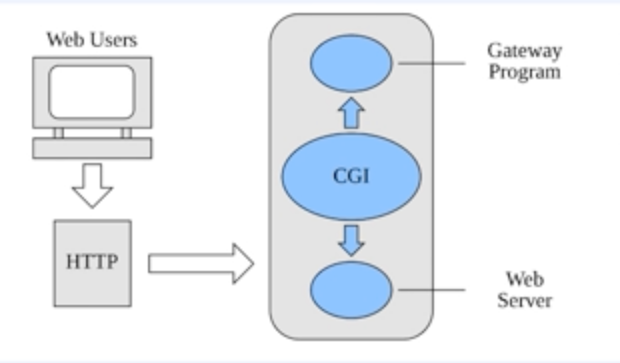
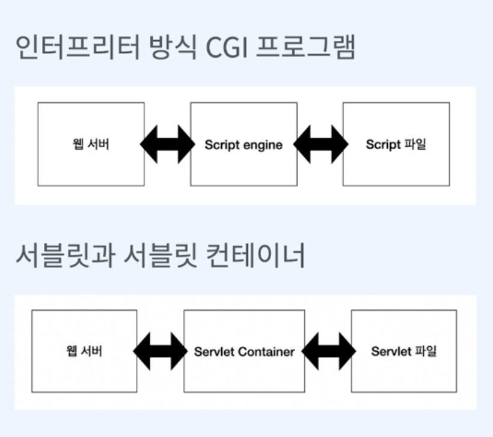
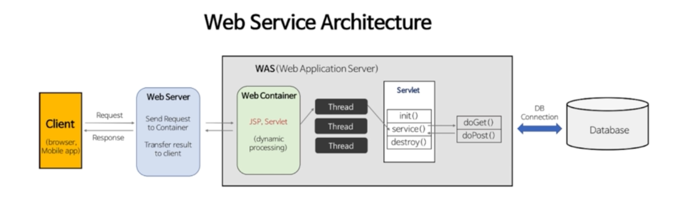

### CGI (Common Gateway Interface) 의 약자이다.

#### 간단히 말해서 웹서버와 어플리 케이션 사이에서 주고 받는 규칙이다.
- CGI 는 웹 서버와 외부 프로그램을 연결해주는 역할을 한다.
- CGI 는 웹 서버가 외부 프로그램을 실행시키고, 그 결과를 웹 서버에게 전달해주는 역할을 한다.
- CGI 의 종류로는 컴파일 방식 C , C++, Java 등과 인터프리터 방식의 Perl, Python, PHP 등이 있다.

### 그림 

### Servlet 은 도대체 뭘까 ...? 
- 자바에서 웹 어플리케이션을 만드는 기술
- 자바에서 동적인 웹 페이지를 구현하기 위한 표준

### 그럼 Servlet 컨테이너는 뭘까 ?
- 서블릿의 생성부터 소멸까지의 라이프 사이클을 관리하는 역할
- 서블릿 컨테이너는 웹 서버와 소켓을 만들고 통신하는 과정을 대신 처리해 준다.
  - 개발자는 비즈니스 로직에만 집중하면 된다.
- 서블릿 객체를 싱글톤으로 관리 (인스턴스 하나만 생성하여 공유하는 방식)
  - 상태를 유지 (stateful) 하게 설계하면 안됨.
  - Tread Safe 하지 않음.

### 엥 Servlet 컨테이너가 Was 라고 하는 사람들도 있던데, 그건 뭐야 ?
- WAS 는 서블릿 컨테이너를 포함하는 개념이다.
- WAS 는 매 요청마다 스레드 풀에서 기존 스레드를 사용한다.
- WAS 의 주요 튜닝 포인트는 max 스레드 수 
- 대표적으로 톰캣, 제티, 언더토우 등이 있다.

