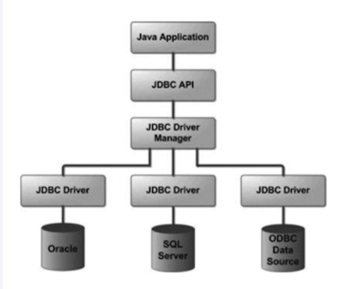

### JDBC (Java Database Connectivity)
- 자바 어플리케이션에서 DB 프로그래밍을 할 수 있도록 도와주는 표준 인터페이스
- JDBC 인터페이스들을 구현한 구현체 들은 각 데이터베이스 벤더사 들이 제공

### DBCP (Database Connection Pool)
- 미리 일정량의 DB 커넥션을 생성해서 풀에 저장해 두고 있다가 HTTP 요청에 따라 필요할 때 커넥션 풀에서 커넥션을 가져다 사용하는 기법
- 참고로 스프링부터 2.0 부터는 디폴트 커넥션 풀로 Hikari Cp 를 사용한다.
- DBCP 라이브러리 종류로는
  - Apache Commons DBCP
  - 톰켓 Commons DBCP
  - Hikari Cp 가 있다.

### 커넥션 풀 유의 사항
- 커넥션의 사용 주체는 WAS 스레드이므로 커넥션 개수는 WAS 스레드 개수와 같거나 크게 설정해야 한다. (고려 필요)
- 커넥션 수를 크게 설정하면 메모리 소모가 큰 대신 동시 접속자 수가 많아지더라도 사용자 대기 시간이 상대적으로 줄게 되고, 
반대로 커넥션 개수를 작게 설정하면 메모리 소모는 적은 대신 그만큼 대기시간이 길어질수 있음. 따라서 적정량의 커넥션 객체를 생성해 두어야 함.

### DataSource
- 커넥션 획득하기 위한 표준 인터페이스
- HikariCp 의 DataSource 사용

