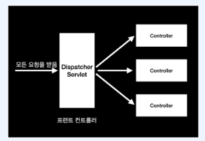
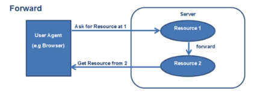
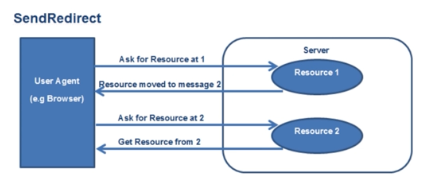

### 프론트 컨트롤러 패턴

- 모든 요청을 단일 handler(처리기) 에서 처리하도록 하는 패턴
- 스프링 웹 MVC 프레임워크의 DispatcherServlet (프론트 컨트롤러 역할) 이 프런트 컨트롤러 패턴으로 구현돼 있음

- 그림 설명: 모든요청을 단일 핸들러인 DispatcherServlet 이 받아서 각 Controller 로 전달하고, 각 Controller 가 처리한 결과를 DispatcherServlet 이 받아서 View 로 전달함

### Forward
- 서블릿에서 클라이언트 (웹 브라우저) 를 거치지 않고 바로 다른 서블릿(또는 JSP) 에 요청하는 방식
- Forward 방식은 서버 내부에서 일어나는 요청이기 때문에 HttpServletRequest, HttpServletResponse 객체가 새롭게 생성되지 않음(공유됨)
- RequestDispatcher = request.getRequestDispatcher("/hello.jsp");
- dispatcher.forward(request, response); // request, response 객체를 공유함
- 서버 내부에서 일어나는 요청이기 떄문에 기존에 만들어진 객체를 공유하는 방식

### Redirect 
- 서빌릇이 클라이언트(웹 브라우저) 를 다시 거쳐 다른 서블릿 (또는 JSP) 에게 요청하는 방식
- Redirect 방식은 서버 내부에서 일어나는 요청이 아니기 때문에 HttpServletRequest, HttpServletResponse 객체가 새롭게 생성됨
- HttpServletResponse 객체의 sendRedirect() 이용
- 해당 요청이 들어왔을때 응답을 WebBrowser 에게 보내고, Web Browser 는 다시 서버에게 요청을 보내는 방식

